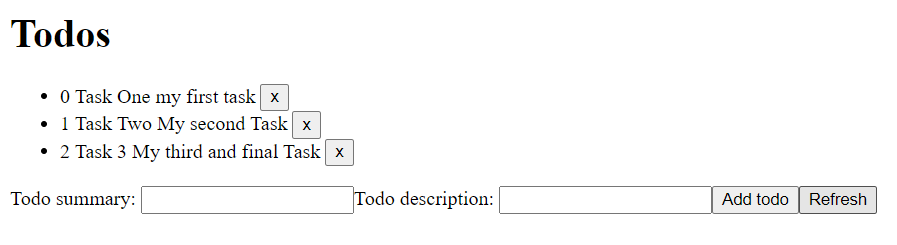

## Lab Report: Software Technology Experiment 6: MVC and SPA, DAT250:

Written by `Nicolas M Mjøs | h578011`

## Technical Problems

### Experiment Two: Cors error

Solved by Proxy \
[Guide I followed](https://angular.io/guide/build#proxying-to-a-backend-server) to redirect`:frontedPort/api`to`:backendPort/`

### Code for experiments:

[Experiment 1: Model-View-Controller Web Applications](./ExperimentOne/) \
[Experiment 2: Single-page applications](./ExperimentTwo/)

### Result Experiment Two:

