## Lab Report: Software Technology Experiment 3: MongoDB, DAT250:

Written by `Nicolas M Mjøs | h578011`

## Technical Problems

None so far.

## Validation of installation package:

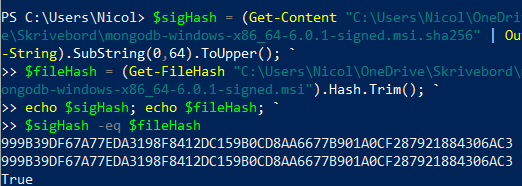

## Experiment 1

### insert

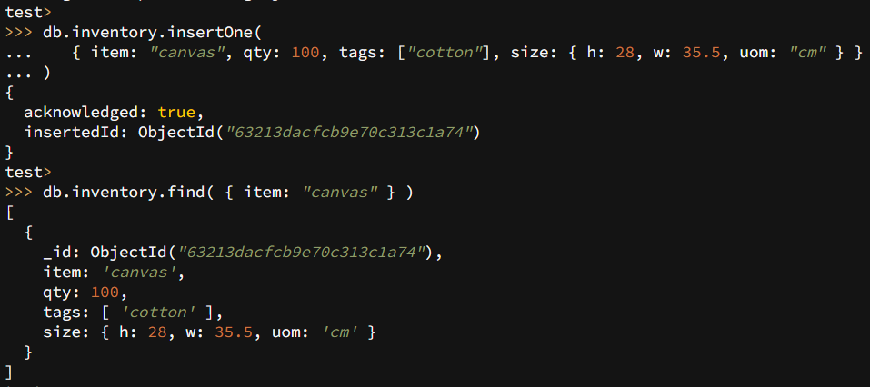
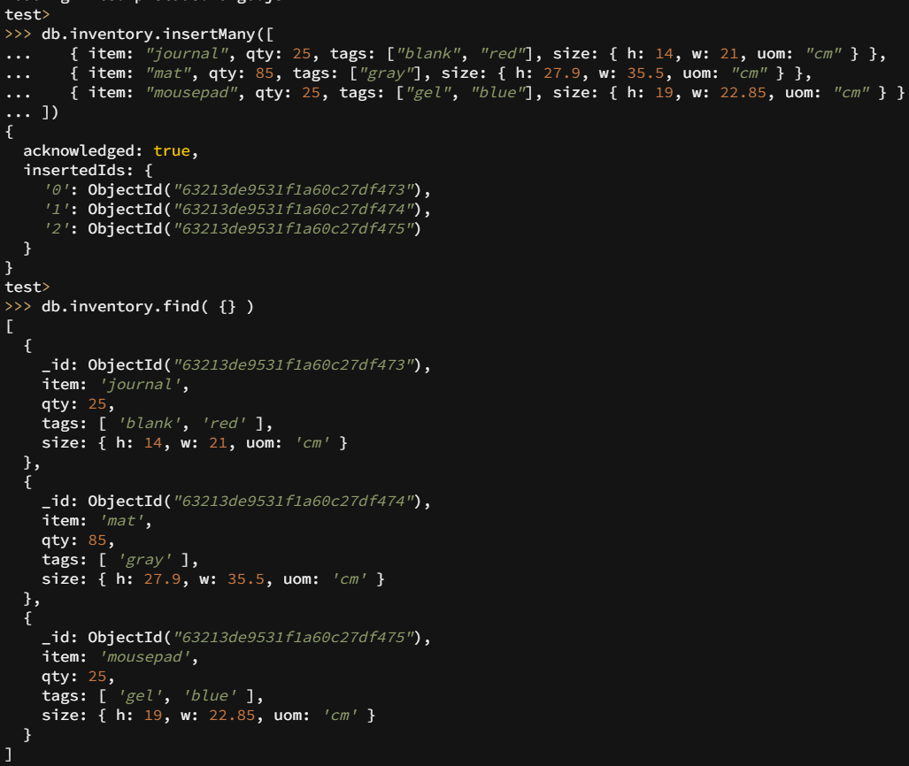

### query

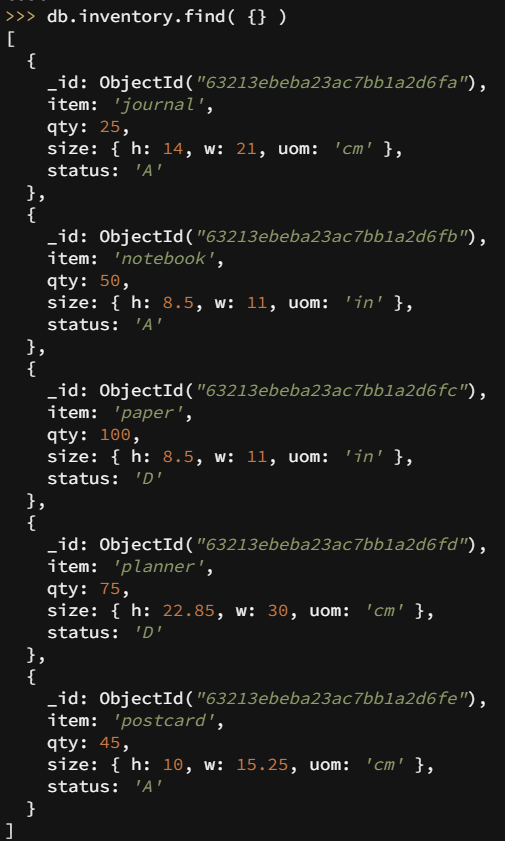
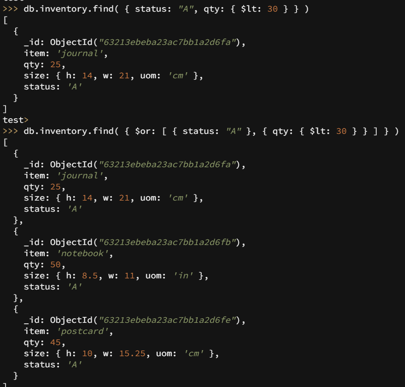
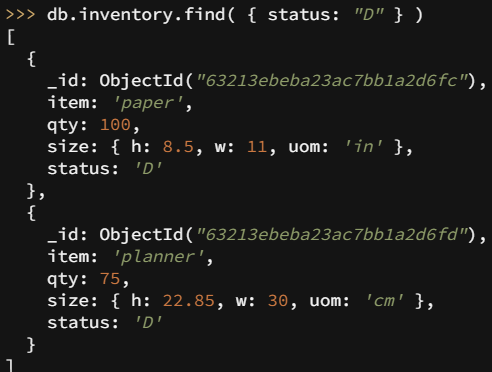
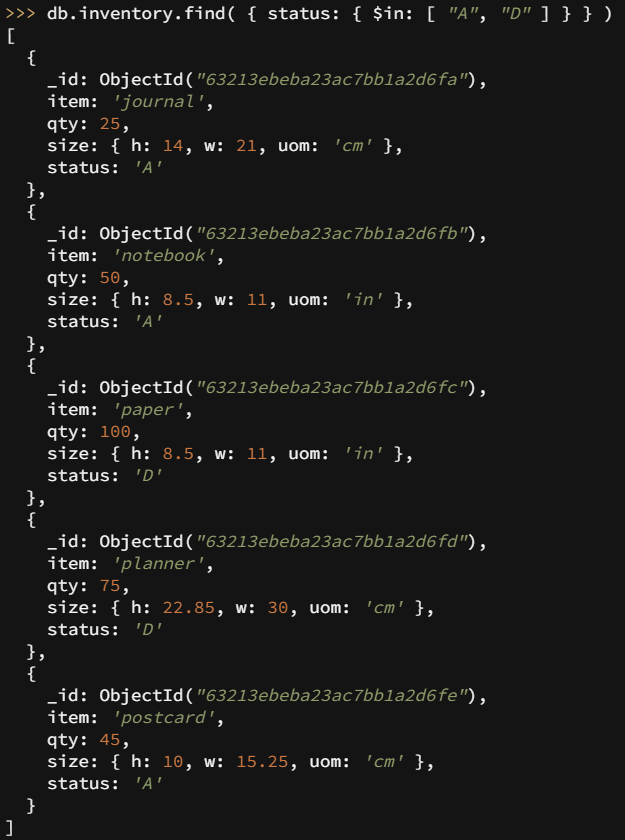

### update

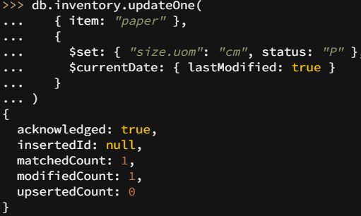

### remove

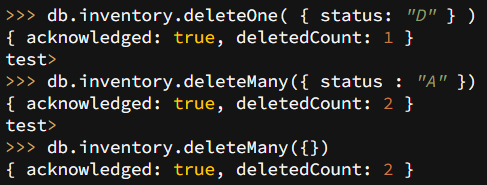

### bulk write operations

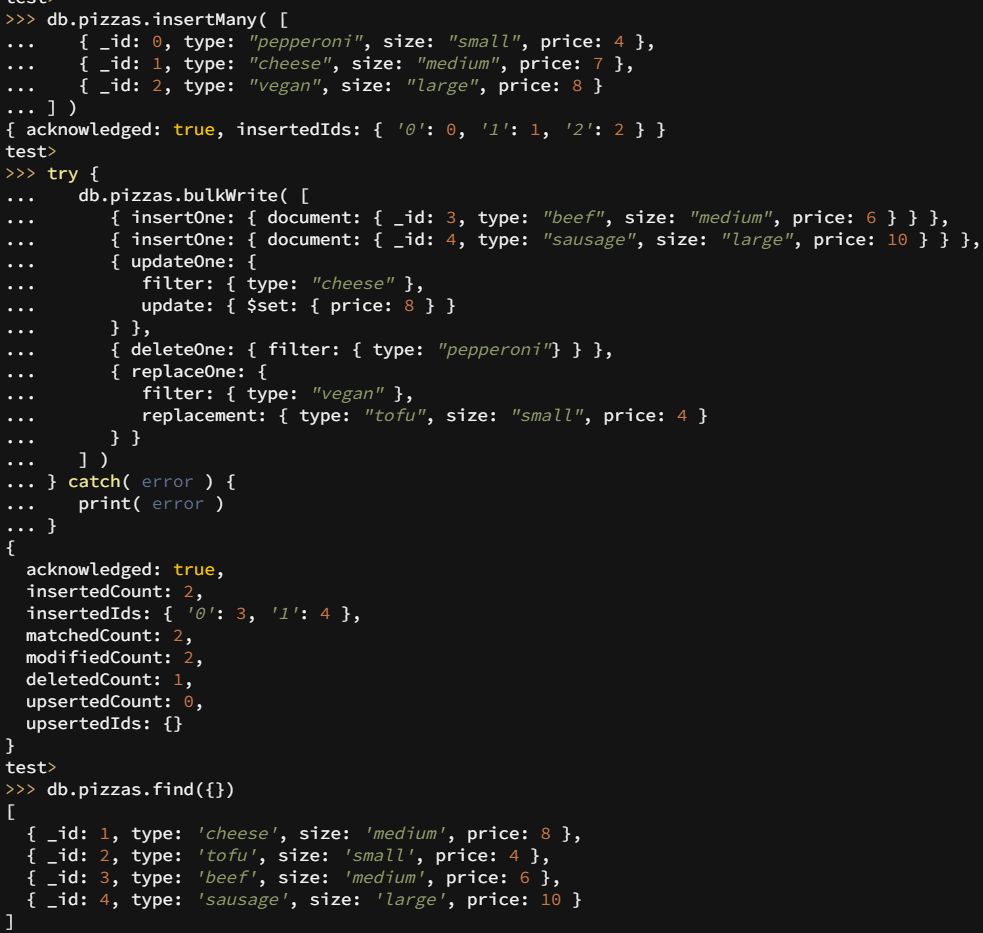

## Experiment 2

#### Initial Database:

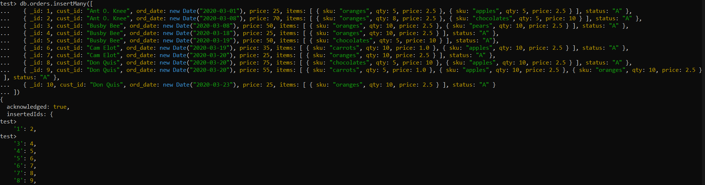

### Total Price Per Customer

#### Map Reduce Example:

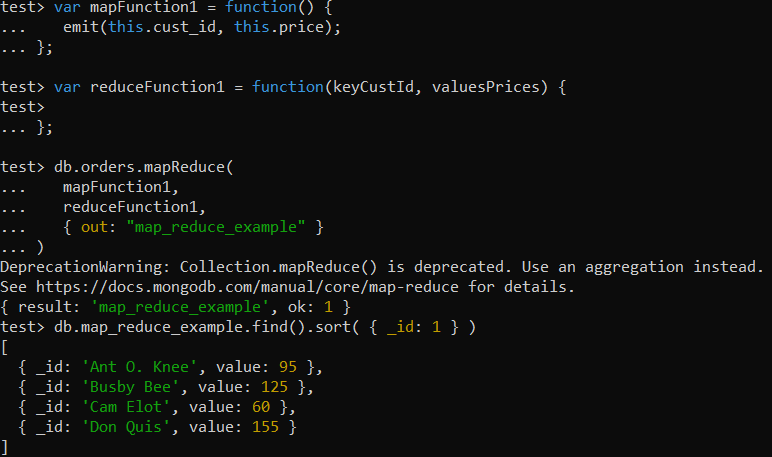

#### Aggregation Alternative:

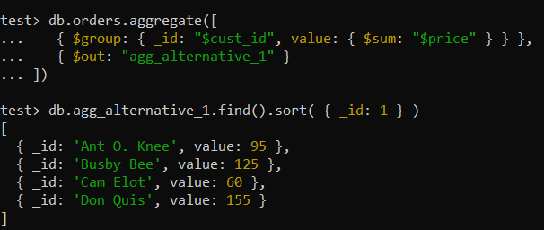

### Calculate Order and Total Quantity with Average Quantity Per Item

#### Map Reduce Example 2:

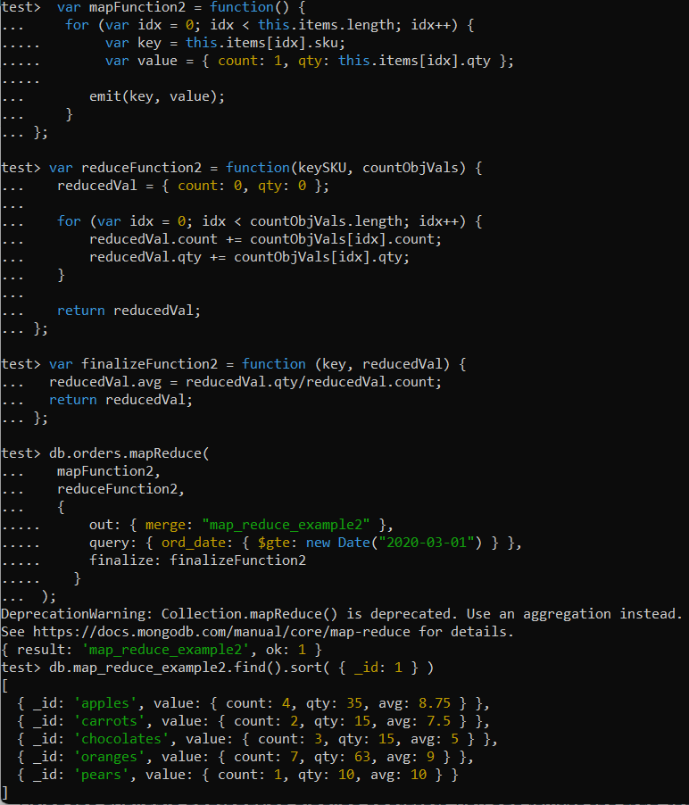

#### Aggregation Alternative 2:

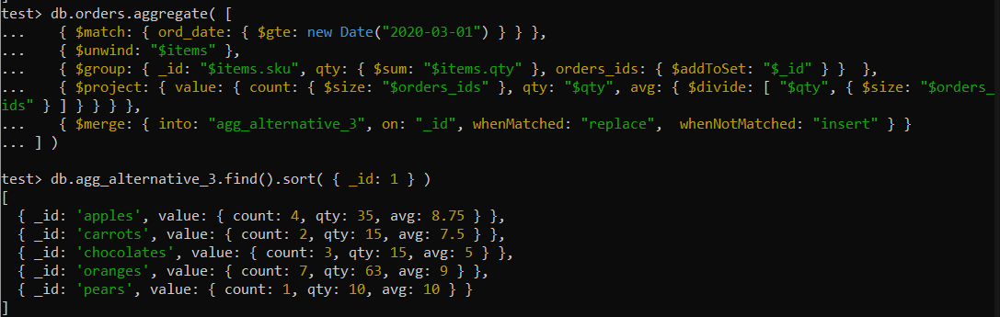

### Custom: calculate average order total per customer

Aim:\
return customers with total amount of orders, customerPriceTotal and mean average order totals.\
Use:\
This function can be useful to analyse customer behavour to for example create rewards programs that encourage customers to spend a little bit more.

Alle mongosh queries are in this [file](./customquery.js).

Result of query:
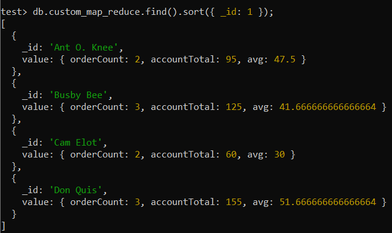
