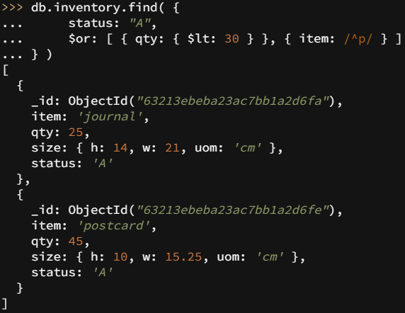

## Lab Report: Software Technology Experiment 3: MongoDB, DAT250:

Written by `Nicolas M Mjøs | h578011`

## Technical Problems

None so far.

## Validation of installation package:

## Experiment 1

### insert

### query

### update

### remove

### bulk write operations

## Experiment 2

#### Initial Database:

### Total Price Per Customer

#### Map Reduce Example:

#### Aggregation Alternative:

### Calculate Order and Total Quantity with Average Quantity Per Item

#### Map Reduce Example 2:

#### Aggregation Alternative 2:

### Custom: calculate average order total per customer

Aim:\
return customers with their median and mean average order totals.\
Use:\
This function can be useful to analyse customer behavour to for example create rewards programs that encourage customers to spend a little bit more.

\
\

- - Experiment 2 example working and the additional Map-reduce operation (and its result) developed by each of you.

- Reason about why your implemented Map-reduce operation in Experiment 2 is useful and interpret the collection obtained.

- Any pending issues with this assignment which you did not manage to solve
