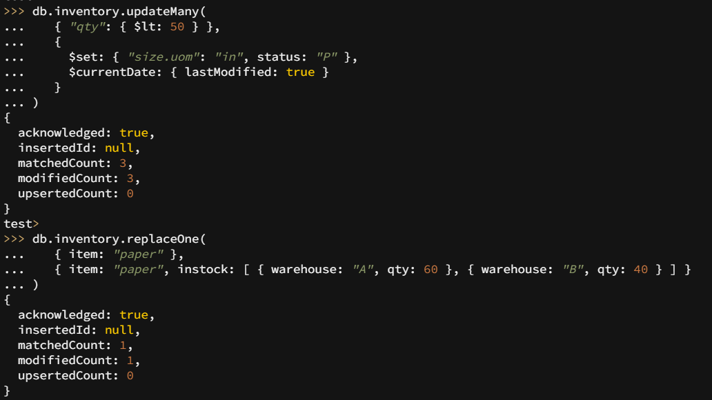

## Lab Report: Software Technology Experiment 3: MongoDB, DAT250:

Written by `Nicolas M Mjøs | h578011`

## Technical Problems

None so far.

## Validation of installation package:

## Experiment 1

### insert

### query

### update

### remove

### bulk write operations

- - Experiment 2 example working and the additional Map-reduce operation (and its result) developed by each of you.

- Reason about why your implemented Map-reduce operation in Experiment 2 is useful and interpret the collection obtained.

- Any pending issues with this assignment which you did not manage to solve
