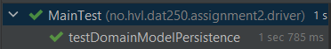
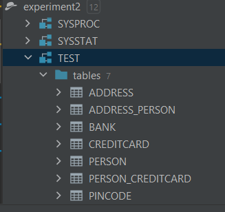
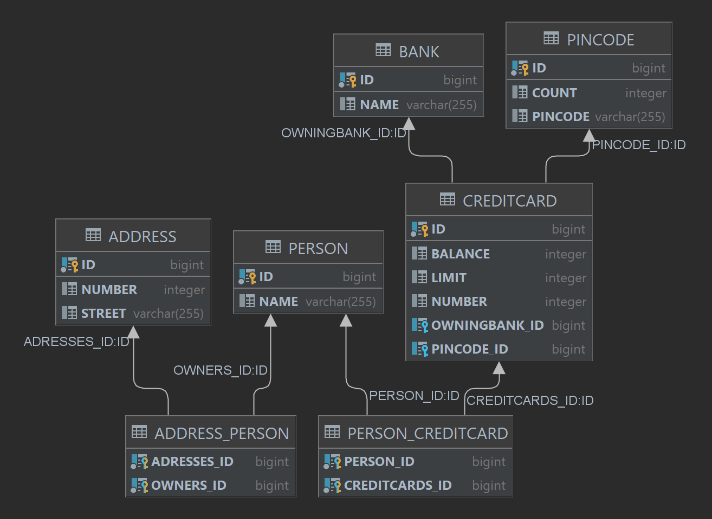

## Lab Report: Software Technology Experiment 2: JPA, DAT250:

Written by `Nicolas M Mjøs | h578011`

### Technical Problems

None encountered this time.

### Code

[Code](./experiment-2/) \

### Inspecting database

I inspected the DB through intellij built in database tool. I added a Derby database as source linked to the [/db/experiment2](./experiment-2/db/experiment2/) folder.

I am provided with this view:

Here I can right click `TEST` and select `Diagrams/Show Vizualisation..` to get image rendered below. As well as perform other database operations and open a query console.

I had to change the `Adress.getOwners()` to a `Set<Person>` method to get the tests running sucessfully. I'm still not sure if I used the correct List/Collection/Set for the ManyToMany/OneToMany relationships.

I'm also not sure of the significance of the ownership of the relationship `ADRESS_PERSON`.
